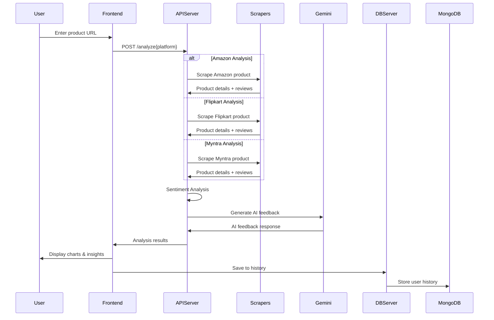
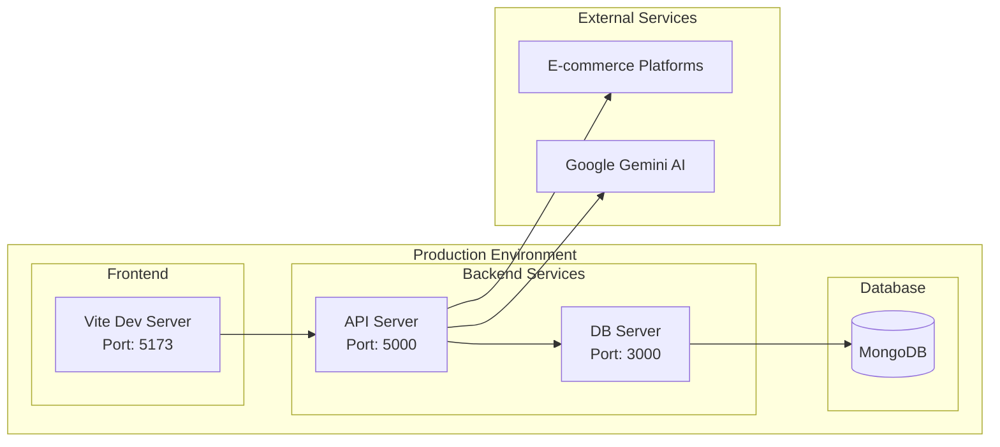

# Voice-of-Customer Project Architecture Diagram

## System Overview
The Voice-of-Customer project is a full-stack web application that analyzes customer sentiment from e-commerce product reviews across multiple platforms (Amazon, Flipkart, Myntra).

## Architecture Components

```mermaid
graph TB
    %% User Interface Layer
    subgraph "Frontend (React + Vite)"
        UI[User Interface]
        UI --> Login[Login Page]
        UI --> SignUp[SignUp Page]
        UI --> Home[Home Page]
        UI --> Profile[Profile Page]
        UI --> Layout[Layout Component]
    end

    %% Backend Services
    subgraph "Backend Services"
        subgraph "Main API Server (Express.js)"
            API[Main API Server<br/>Port: 5000]
            API --> AmazonScraper[Amazon Scraper]
            API --> FlipkartScraper[Flipkart Scraper]
            API --> MyntraScraper[Myntra Scraper]
            API --> SentimentAnalysis[Sentiment Analysis]
            API --> AIGenerator[AI Feedback Generator<br/>Gemini 1.5 Flash]
        end
        
        subgraph "Database Server (Express.js)"
            DBServer[Database Server<br/>Port: 3000]
            DBServer --> HistoryRoutes[History Routes]
            DBServer --> PasswordRoutes[Password Routes]
        end
    end

    %% External Services
    subgraph "External Services"
        Amazon[Amazon.com]
        Flipkart[Flipkart.com]
        Myntra[Myntra.com]
        Gemini[Google Gemini AI]
    end

    %% Database Layer
    subgraph "Database (MongoDB)"
        MongoDB[(MongoDB Database)]
        MongoDB --> HistoryCollection[History Collection]
        MongoDB --> UserCollection[User Collection]
    end

    %% Data Flow
    UI -->|HTTP Requests| API
    API -->|Web Scraping| Amazon
    API -->|Web Scraping| Flipkart
    API -->|Web Scraping| Myntra
    API -->|AI Analysis| Gemini
    DBServer -->|CRUD Operations| MongoDB
    
    %% Styling
    classDef frontend fill:#e1f5fe
    classDef backend fill:#f3e5f5
    classDef external fill:#fff3e0
    classDef database fill:#e8f5e8
    
    class UI,Login,SignUp,Home,Profile,Layout frontend
    class API,AmazonScraper,FlipkartScraper,MyntraScraper,SentimentAnalysis,AIGenerator,DBServer,HistoryRoutes,PasswordRoutes backend
    class Amazon,Flipkart,Myntra,Gemini external
    class MongoDB,HistoryCollection,UserCollection database
```



## Detailed Component Breakdown

### 1. Frontend Layer (React + Vite)
- **Technology Stack**: React 18, Vite, Tailwind CSS, Chart.js
- **Key Components**:
  - `App.jsx`: Main application router and state management
  - `Home.jsx`: Product analysis interface with forms for each platform
  - `Login.jsx` & `SignUp.jsx`: Authentication pages
  - `Profile.jsx`: User profile management
  - `Layout.jsx`: Common layout wrapper

### 2. Backend Services

#### Main API Server (Port: 5000)
- **Technology**: Express.js, Axios, Cheerio, Puppeteer
- **Key Endpoints**:
  - `POST /analyze`: Amazon product analysis
  - `POST /analyzeFlipkart`: Flipkart product analysis
  - `POST /analyzeMyntra`: Myntra product analysis
  - `GET /analyze`: Retrieve last analysis results

#### Database Server (Port: 3000)
- **Technology**: Express.js, Mongoose
- **Key Endpoints**:
  - `/history`: User search history management
  - `/password`: User authentication management

### 3. Web Scraping Components

#### Amazon Scraper
- **Technology**: Cheerio, Axios with retry logic
- **Features**: 
  - Product details extraction
  - Rating distribution analysis
  - Review sentiment analysis
  - Anti-bot detection measures

#### Flipkart Scraper
- **Technology**: Puppeteer
- **Features**:
  - Headless browser automation
  - Multi-page review scraping
  - Product image and details extraction

#### Myntra Scraper
- **Technology**: Puppeteer
- **Features**:
  - Infinite scroll review collection
  - Fashion product analysis
  - Review text extraction

### 4. AI & Analysis Components

#### Sentiment Analysis
- **Library**: `sentiment` npm package
- **Features**:
  - Text sentiment scoring
  - Positive/negative/neutral classification
  - Sentiment intensity calculation

#### AI Feedback Generator
- **Service**: Google Gemini 1.5 Flash
- **Features**:
  - Natural language feedback generation
  - Product improvement suggestions
  - Summary of customer sentiment

### 5. Database Schema

#### History Collection
```javascript
{
  username: String,
  history: [{
    product_name: String,
    URL: String,
    image_url: String
  }]
}
```

#### User Collection
```javascript
{
  username: String,
  password: String
}
```

## Data Flow Architecture



## Technology Stack Summary

### Frontend
- **Framework**: React 18 with Vite
- **Styling**: Tailwind CSS
- **Charts**: Chart.js with React Chart.js 2
- **Routing**: React Router DOM
- **Build Tool**: Vite

### Backend
- **Runtime**: Node.js
- **Framework**: Express.js
- **Web Scraping**: 
  - Cheerio (Amazon)
  - Puppeteer (Flipkart, Myntra)
- **HTTP Client**: Axios with retry logic
- **AI Integration**: Google Generative AI (Gemini)

### Database
- **Database**: MongoDB
- **ORM**: Mongoose
- **Collections**: History, User authentication

### External Dependencies
- **AI Service**: Google Gemini 1.5 Flash
- **E-commerce Platforms**: Amazon, Flipkart, Myntra
- **Browser Automation**: Puppeteer with Chrome

## Security & Performance Features

### Security
- CORS configuration for frontend-backend communication
- Environment variable management for API keys
- Input validation and error handling
- Anti-bot detection measures in scrapers

### Performance
- Retry logic with exponential backoff
- Request timeout configurations
- User-Agent rotation for web scraping
- Caching of analysis results
- Optimized database queries

### Scalability
- Modular architecture with separate services
- Stateless API design
- Database indexing for user queries
- Configurable scraping limits

## Deployment Architecture



This architecture provides a robust, scalable solution for analyzing customer sentiment across multiple e-commerce platforms with real-time web scraping, AI-powered insights, and comprehensive data visualization. 
